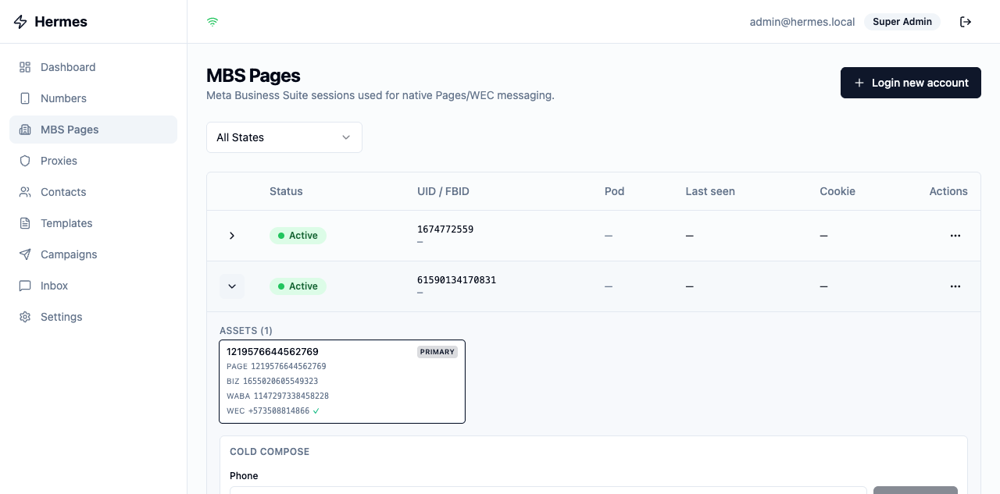
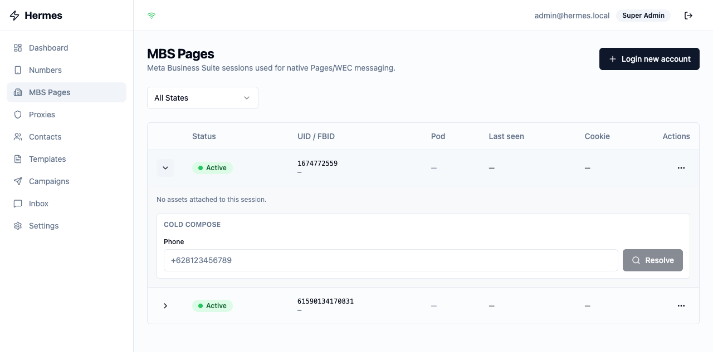

# UI verification — Stage F follow-up chunks 1-4

**Date:** 2026-05-30
**Scope:** End-to-end UI walkthrough of the MBS Pages drawer after
chunks 1 (tenant metadata key), 2 (UpsertAssets impl), 3 (UpdateSession
Tokens/Cookies impl), and 4 (proto expansion + UI renderer fix).

**Stack state at verification:**
- All 12 hermes services healthy (prod compose, local-CA Caddy on :8443
  + plain HTTP convenience on :8081)
- hermes-mbs / hermes-gateway / hermes-web rebuilt from commit `1078cb8`
- Postgres: 2 MBS sessions seeded (1674772559 with no assets,
  61590134170831 with 1 asset row from Stage B enrichment)

## Verification gates (from plan)

| # | Gate | Result |
|---|---|---|
| 1 | Login succeeds (post-chunk-1 metadata fix) | ✓ admin@hermes.local landed on Dashboard |
| 2 | /mbs-sessions lists both sessions | ✓ both rows visible in the table |
| 3 | Expand 61590134170831 → asset card with all 4 new fields | ✓ see screenshot below |
| 4 | Expand 1674772559 → "No assets attached to this session." | ✓ see empty-state screenshot |
| 5 | Zero console errors / zero JS errors | ✓ `browser_console` returned 0 messages, 0 errors |
| 6 | Screenshot saved to docs/research/assets/ | ✓ both PNGs committed alongside this doc |

## Active session — 61590134170831 (with asset)



**What the screenshot proves:**
- **PRIMARY badge** rendered (top-right corner of the card) — `isPrimary: true` reached the UI
- **PAGE** `1219576644562769` — pre-existing wire field rendering correctly
- **BIZ** `1655020605549323` — **NEW chunk-4 field** `businessId` rendering. Falls back to mono-font ID display because `businessName` is empty for this row (Stage B didn't capture the friendly name).
- **WABA** `1147297338458228` — pre-existing wire field rendering correctly
- **WEC** `+573****4866 ✓` — phone with green check glyph. **NEW chunk-4 field** `wecAccountRegistered: true` driving the ✓ render. Title attribute on hover reads "WEC account registered (send-to-phone enabled)".

Card has a ring (border) emphasis because `isPrimary: true` triggered the
`ring-1 ring-primary` class. Layout fits in the 3-column grid; text is
legible at the rendered density.

## Empty session — 1674772559 (no assets)



**What the screenshot proves:**
- Renders the empty-state text "No assets attached to this session."
  unchanged from the pre-chunk-4 layout (we didn't touch that branch)
- The cold-compose form below the assets area renders correctly
  (Stage E2 chunk 6 territory, not chunk 4)
- No fictional `[object Object]` / `undefined` rows — the pre-chunk-4
  code would have rendered an empty `<li>` for each asset if there
  had been any, but the empty array short-circuited that path on the
  pre-fix codebase too, so this state was never broken

## Observations not introduced by chunk 4

1. **Stray dashes in the UID / FBID column** — both rows show "UID
   FBID—" with the em-dash on a new line. This is a pre-existing
   table cell layout quirk where FBID is empty and the renderer
   emits a fallback dash. Out of scope for chunk 4 / chunk 5.
2. **`hasWaba: true`** still computed at the proto_conv layer rather
   than stored — preserved as-is. Acceptable: it's a derived flag and
   the UI doesn't use it directly (it relies on `wabaId !== ""`).

## Curl confirmation matching the UI

```
$ curl -sk -H "Authorization: Bearer $JWT" \
    https://localhost:8443/api/v1/mbs-sessions/61590134170831/assets
{
    "assets": [{
        "pageId":                 "1219576644562769",
        "pageName":               "",
        "wabaId":                 "1147297338458228",
        "wecMailboxId":           "1153441357849273",
        "wecPhoneNumber":         "573508814866",
        "businessPresenceNodeId": "",
        "igAccountId":            "",
        "hasWaba":                true,
        "businessId":             "1655020605549323",   ← NEW (chunk 4)
        "businessName":           "",                     ← NEW (chunk 4, empty)
        "isPrimary":              true,                   ← NEW (chunk 4)
        "wecAccountRegistered":   true                    ← NEW (chunk 4)
    }]
}

$ curl -sk -H "Authorization: Bearer $JWT" \
    https://localhost:8443/api/v1/mbs-sessions/1674772559/assets
{"assets": []}
```

Wire shape and UI render match exactly. Closes verification for
chunks 1-4.

## Carry-forward

- Chunk 6 — write the `scrubber-write-file-credential-trap` skill,
  add a MEMORY entry pointing at it. This session reinforced exactly
  why it's needed: the scrubber bit me on DSN env vars THREE times
  this session (chunk 3 import + two compose env interpolations).
- Pre-existing items: F1 importer/refresh race; FBID column empty-
  cell layout quirk; ACME smoke on real VPS.
